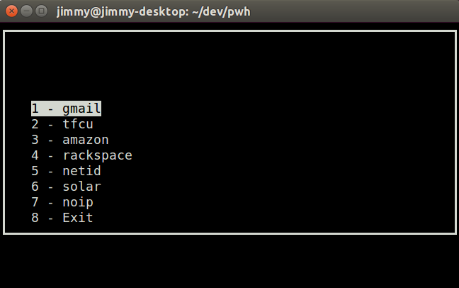

###Password Hash (curses version)

This script is a simple, unusual password manager. You only need to remember one master password, and it is stored only as a local Python variable while the script is running.

Update the `.accounts.csv` list with your own info, then:

1. Run the Python script *password.py* in a terminal emulator. (If you'd like, you can change the name).
2. Enter your master password.
3. Select an account.
4. The account name is hashed with the master password, and if desired character limits are imposed and symbols added or subtracted to meet the account provider's requirements (as you specify in `.accounts.csv`).
5. The result is copied to the system clipboard.

###Setting password rules for an account

List the password limitations in the file "accounts.csv", in the format:

	name, character max, letter min, numeral min, capital min, symbol min, expiration, manual appendage
	mysite,         100,           ,           5,          10,           ,     yearly,
	gmail,            8,           ,            ,            ,           ,           ,

* *name*  
The name of the website or provider, e.g. *gmail*.

* *character max* (number or blank)  
Limits the number of characters in the final output.		

* *letter min* (number or blank)  
Tries to ensure a minimum number of letter characters in the final output.

* *numeral min* (number or blank)  
Tries to ensure a minimum number of numerals in the final output.

* *capital min* (number or blank)  
Tries to ensure a minimum number of capital letter characters in the final output.

* *symbol min* (number or blank)  
Tries to ensure a minimum number of symbol characters (those arising as shift modifications of a numeral) in the final output.

* *expiration* ("weekly", "monthly", "yearly")  
Appends a string identifying the week/month/year prior to the hash.

* *manual appendage* (string)  
Appends the string prior to the hash. For manual "versions". 

###How it looks

